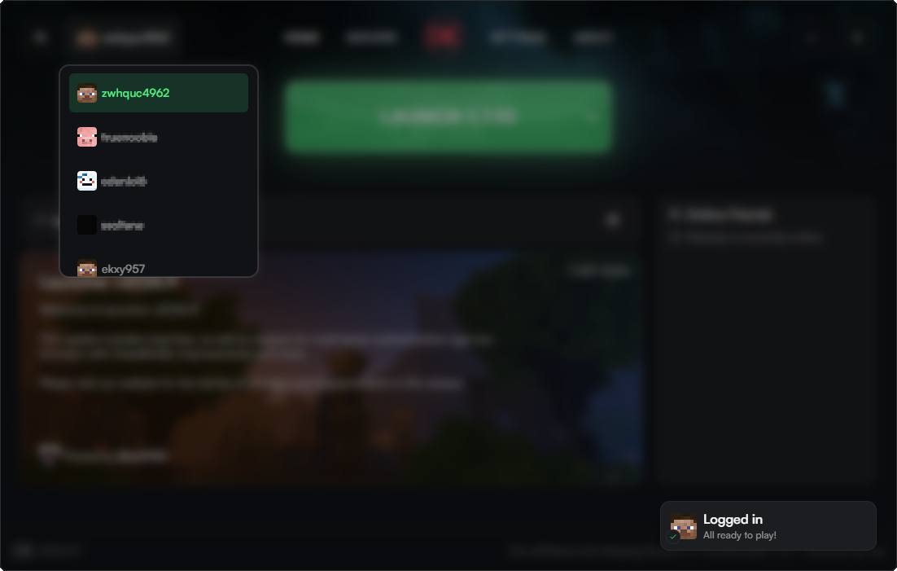

# crack-account-cheatbreaker

Offline-account patcher for the CheatBreaker launcher (Windows, v2026.9.1).

Adds username-only accounts so you can play on servers that accept offline sessions. Premium accounts are left untouched and the server-side online-mode filter still decides who can join.

## Download

Grab `cia_patcher_1.1.7.exe` from [Releases](https://github.com/ryad313/crack-account-cheatbreaker/releases/latest). Copy the EXE alone; the Java patching tools are embedded.

On startup the patcher checks `latest.json` in this repository and updates itself automatically when a newer build is published.

## Usage

1. Run `cia_patcher_1.1.7.exe`
2. Type a nickname (3-16 letters/digits/underscore, must not be an existing premium name) - or `r` for a random one
3. CheatBreaker starts automatically, the account is already selected

## What it patches

Launcher (Electron, `app.asar`):

- Offline login (UUID v3 `OfflinePlayer:<name>`, no Microsoft account involved)
- Launch flow that no longer depends on CheatBreaker's asset server
- Offline accounts filtered out of the packets sent to CheatBreaker's backend
- UI gates unlocked so the launch button works without backend authentication
- Client jar kept across launches (no re-download that would revert the game patch)

Game client (Java, 1.7.10 and 1.8.9):

- Title screen unlocked: SINGLEPLAYER / MULTIPLAYER usable with an offline account

## Requirements

- Windows with CheatBreaker 2026.9.1 installed
- Launch the game once before first use (the client jar must exist)

## Notes

- v1.1.7 fixes the Java class-format crash in v1.1.6. If v1.1.6 already modified your game clients, restore pristine client jars before applying v1.1.7; the new patcher does not undo the old changes automatically. See [build and validation notes](BUILD_V1.1.7.md).
- A full clean-machine launch and the zero-premium-account scenario still need validation.
- **[how_to_update.md](how_to_update.md)** — full engineering bible: architecture, patch inventory, rules, traps catalog, and step-by-step procedures to patch a new CheatBreaker version or ship a new patcher release.
- Premium Minecraft servers will still reject offline sessions; only servers running `online-mode=false` accept them.
- Modifying the launcher may violate CheatBreaker's terms of service, and playing multiplayer without owning the game violates the Minecraft EULA.
- Not affiliated with CheatBreaker LLC or Mojang Studios. Use at your own risk.
